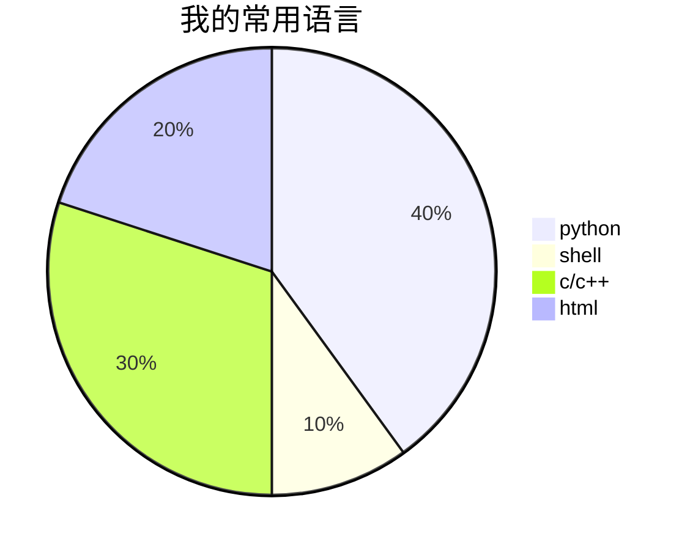
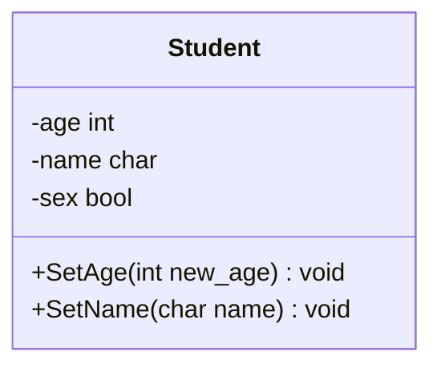

## markdown

### 基本语法

这里因为我用的是 typora 可能有些操作和大家的不太一样

 (似乎我的这个主题将加粗变成了 就是快速修改颜色)

|   元素   | 语法                                |
| :------: | ----------------------------------- |
|   标题   | #  ## 数目表示 几级标题             |
|  超链接  | `[显示的内容](链接)`                |
|   图片   | ``                |
|   加粗   | `**加粗**`  **加粗的字体**          |
|   斜体   | `*倾斜*`*倾斜的字体*                |
| 加粗斜体 | `***加起来***`   ***加粗斜体\***    |
|  分割线  | `---`  — 或者 `***`                 |
|   高亮   | `==高亮==`== 高亮 ==                |
|  删除线  | `~~删除的内容~~`~~被删除了~~        |
|   代码   | `code` 利用两个 ` 多行代码就是 三个 |
| 无序列表 | 利用没有人用的符号 比如 `+ *`       |
| 有序列表 | 1. 2. 也好理解                      |
|   引用   | `>`  有的引用是 tab 笑死我了        |
| 任务清单 | `- [ ]` -[ ] `- [X]`                |

### 高级语法

#### 脚注

为什么要用脚注[^测试] 目前脚注的书写[^注意事项]

```
[^脚注]
[^脚注]:对脚注的解释
```

脚注同样可以跳转 

[^注意事项]: 对应的脚注必须完全相同 连空格都不可以多 我就是看错了 主要是这个一会斜体 一会正体 我服了 真的

[^测试]: 使用脚注可以压缩信息在很短的文字内显示更多的信息 而且可以让观看者 有选择地去阅读 是一种很好的东西哦 [某个参考教程](https://zhuanlan.zhihu.com/p/342135587)

#### 表格

typora 的表格非常简单 只需要写下首栏即可

对其和添加格子都可以交给它 nice

```
|姓名|学号|
```

| 姓名 | 学号 |
| ---- | ---- |
|      |      |

#### 标题跳转

很不幸 我们的 typora 点击链接 不是进入链接 而是查看源代码 所以无法使用 但是在 vscode 里就可以了 (这个？)

学会了 只要按下 `CTRL` 的同时点击链接就好了 无敌好吧我的 typora

```
[标题跳转](#某个标题)
```

[回到首页](#markdown)

#### 锚点跳转

首先我们定义锚点 然后就像使用链接一样 使用我们的锚点就好了 其实就是根据元素的name进行跳转

```
[跳转至name=tag 的锚点](#tag)
```

<a name="tag">这里是一个锚点 name=tag</a>

[跳转至 name=tag 的锚点](#tag)

#### 跳转至其他文件

```
[跳转](DZG.md) 直接指向文件的名称就好了
这个在我们的网页中是无法使用的 因为没有md文件
可不可以变成html文件 呢? 有想法的你
```

[跳转至其环境变量 html]

[跳转至环境变量 md]

是否可以跳转到其他文件的某个位置?  🆗的

就是将上面的组合起来就好了 文件+锚点 完美解决问题 哈哈哈哈 

```
[标题跳转](文件的路径#某个标题)
```

## HTML

很好奇对不对？为什么我要讲这个 其实我们的 typora 就是一个浏览器 将我们的文本进行渲染成 html 所以我们可以使用 html 标签进行编写 md

前排提示 发现 iframe 没有 embed 好用 

特别是在网页上 如果使用 iframe 无法进行交互 但是我们的 embed 就可以交互 这样的体验肯定是要好得多的

```
统一资源插入格式
src = "http://43.143.151.27/ftp/"
```

### 改变字体样式

其实就是对其写 css 不过考虑到其实不是很经济 (花费过多的时间了) 就不考虑了吧


```
<p style="color:red;"> 
    红色的字体 
    感觉怎么样
</p>
```

<p style="color:red;"> 
    红色的字体 
    感觉怎么样
</p>

### 插入视频

本地视频还可以 但是如果是上传到网络上就比较堪忧了 主要是很容易因为网络延迟 影响我们的观看体验

除非我们可以做一个 B 站插件 一件上传我们的视频 就是说 这个不太可能我觉得 就是说 白嫖 B 站我觉得有点难了

两中方式 我觉得如果是本地视频 还是 video 要方便很多 

但是第三方的 还是使用 embed + player.com 吧

```
<video src = "D:\1.CS\git_hub\大数据导论\video.mp4">

<embed src = "//player.bilibili.com/player.html?aid=983940611&bvid=BV1Ht4y1V7hF&cid=787857810&page=2" width="100%" height="400px">
```

现在想的方法是说统一采用服务器的网络带宽 这样不会就是对于服务器的压力太大了吗

typora 是会做优化吗？为什么就是说 会自己去加载啊 而且加载的速度还很快

如果想插入第三方的视频 可以使用如下的方法

<embed src = "//player.bilibili.com/player.html?aid=983940611&bvid=BV1Ht4y1V7hF&cid=787857810&page=2" width="100%" height="400px">

先获取视频的播放格式 点击嵌入代码

直接粘贴 代码即可 不过要设置一下高度 不然看起来会很奇怪
需要我解释参数的含义吗 大家应该都看得懂 html 的基本语法吧 

### 插入音频

支持 mp3 wav ogg 猜的 啊哈哈哈 

使用本土的 audio 就好了 

这些都存在一个问题 就是我们该如何解决本地和网络的区别啊 先尝试头痛死了 放到 ftp 上面去吗？

```
<audio src = "https://zuoge-1307686113.cos.ap-nanjing.myqcloud.com/video/giegie.mp3">
```

<audio src = "">


### 插入网页

想不到吧哈哈哈哈 真的很有意思 

下面是我的博客展示 等等啊 在我的博客里面看我的博客展示 是不是很奇怪啊 😂

同样的按下 `CTRL` 可以直接从浏览器打开我们的网页 但是这样就不是聚合了 哈哈

还可以玩游戏 我的天啊 太强大了吧 哈哈哈

```
<embed src = "http://81.68.91.70/" width ="100%" height= "500px">
```

<embed src = "./BLOG/2048/" width ="100%" height= "500px">

### 插入 pdf

一定要设置宽度 不然字体真的太小了

```
<embed src="http://43.143.151.27/ftp/Essay/国内外数据安全研究领域前沿动态追踪 基于2013年以来的文献计量分析.pdf"  width = "100%" height="600" >
```

## Mermaid

这个你可以理解为 思维导图的 md 版本 个人其实不是很推荐 主要是使用起来比较麻烦

[详细教程](https://zhuanlan.zhihu.com/p/166668789)

[简明教程](https://zhuanlan.zhihu.com/p/355997933)

### 让 hexo 支持 Mermaid

我学会这三个就够了

| 指令         | 功能   |
| ------------ | ------ |
| pie          | 饼图   |
| graph        | 流程图 |
| classDiagram | 类图   |

### 饼状图 (PIE)

```
pie 
	title 我的常用语言
	"python" :4
	"shell" :1
	"c/c++" :3
	"html" :2
```



### 流程图 (GRAPH)

默认是 TD 可选参数 LR RL


```
graph LR
	小学--> 初中 --> 高中--> 大学
	高中-->大专
	中专-->大学
	初中--> 中专 --> 大专
```


### 类图 (classDiagram)

服了 原来老师讲的确实是真的 

```
classDiagram
	class Student{
  		-age int
  		-name char
  		-sex bool
  		+SetAge(int new_age) void
  		+SetName(char name) void
  }
```



## Latex

typora 支持插入数学公式 利用

### 字母 和 符号

| 字母 | 表示方法  | 符号 | 表示方法 |
| :--: | :-------- | :--: | :------- |
|  𝜃   | `\theta`  |  ∫   | `\int`   |
|  𝜆   | `\lambda` |      |          |
|      |           |      |          |
|      |           |      |          |
|      |           |      |          |
|      |           |      |          |
|      |           |      |          |

### 特殊表示


### 一些案例

我的高速

我的高代

我的离散

## 存在的问题

- 如果使用本地路径 肯定就无法在网页端查看 

> 但是我们使用 网络上的绝对地址也不是很方便啊

```

```


```
网络格式
src ="http://43.143.151.27/ftp/Video/video.mp4" 

```


```
本地格式
src = "D:\ftp\Video/video.mp4"
```

其实两者差不多 就是开头的前缀要改成 http://ip

这样的话 我的电脑也要有 ftp 文件夹？不是啊 文件不就是你放上去的吗？

- 更加严重的是 如果无法打开了 

> 会导致后面的文本无法正常生成 我的天哥 

- mermaid 还是无法生成图像 比较麻烦 等等我看看
- 我们的 md 文件必须标题和 title 是一样的

