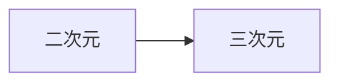

# 一级标题

## 二级标题

### 三级标题

#### 四级标题


* 1
* 2

*斜体*

**加粗**


| 表   | 格   |
| ---- | ---- |
| 测   | cs   |


[链接测试_我的博客](https://km911.github.io/BLOG)


数学公式

$\int_a^b  sin(x) + \frac{1}{2}$


````yaml
代码的高亮测试
# KaTeX
katex:
  enable: false
  per_page: false
  hide_scrollbar: true
````


* typora表情 :cry: 
* emoje 😂


## 测试mermaid




